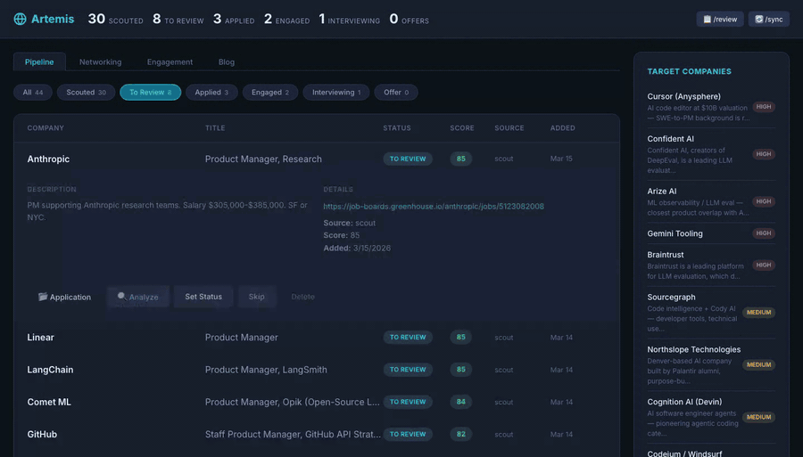
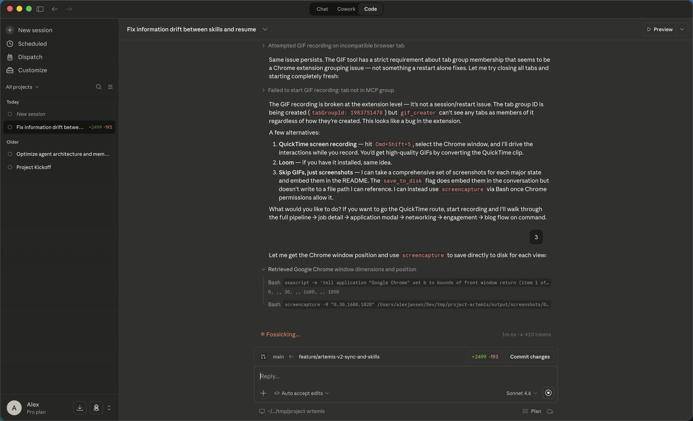

# Project Artemis

[](LICENSE)

**An autonomous job hunting system powered by Claude Code.** Artemis scouts for jobs, manages your pipeline, generates tailored application materials, coaches you for interviews, manages your networking, monitors your inbox and calendar, browses LinkedIn, and helps you build a personal brand through blogging.



**[Full UI Walkthrough →](docs/UI_WALKTHROUGH.md)**

---

## Quick Start

### Prerequisites

- **Python 3.11+** and **[uv](https://docs.astral.sh/uv/)**
- **Supabase** project (free tier works)
- **Claude Code** (`npm install -g @anthropic-ai/claude-code`)
- **Node.js 18+** and **[Bun](https://bun.sh)** (for the dashboard and channels)
- **tmux** (`brew install tmux`)
- **LibreOffice** (optional, for PDF generation): `brew install --cask libreoffice`

For the full setup walkthrough (Supabase, MCP integrations, Telegram, scheduled automation), see **[docs/getting-started.md](docs/getting-started.md)**.

### 1. Clone and run setup

```bash
git clone <repo-url> project-artemis
cd project-artemis
./scripts/setup.sh
```

The setup script checks prerequisites, installs all dependencies (Python, Node, Bun), sets up state file templates, configures your `.env`, and verifies the Supabase connection.

### 2. Sign in

```bash
artemis-login login              # email + password, or use --magic-link
# Then start Claude Code
```

### 3. Launch Claude Code

```bash
claude --plugin-dir .
```

Artemis is a **Claude Code plugin** -- all skills, agents, hooks, and tools are self-contained at the project root. The `orchestrator` agent is auto-discovered and session hooks fire automatically.

On first launch, state will be pulled from Supabase. On a fresh clone, the session hook detects that no candidate profile exists and prompts you immediately. Run `/artemis:setup` to walk through the setup wizard, or just say **"Set me up"**.

### 4. Start all services

```bash
./scripts/start.sh
```

This launches the API server, React dashboard, and orchestrator in a single tmux session. For Claude Desktop users (without CLI orchestrator), use `./scripts/start.sh --no-orchestrator`.

The dashboard opens at `http://localhost:5173` — you'll see a login screen (use the same credentials as above).

See [docs/getting-started.md](docs/getting-started.md) for details.

---

## Skills & Commands

| Skill | Commands | What it does |
|-------|----------|-------------|
| **scout** | `/artemis:scout`, `/artemis:sync`, `/artemis:review`, `/artemis:status` | Discover jobs, maintain pipeline, triage |
| **apply** | `/artemis:analyze`, `/artemis:generate`, `/artemis:submit` | Evaluate fit, generate application materials, mark submitted |
| **network** | `/artemis:network` | Manage contacts, draft outreach, track status |
| **profile** | `/artemis:context`, `/artemis:prep` | Build candidate context cache, interview prep |
| **coach** | `/artemis:kickoff`, `/artemis:practice`, `/artemis:mock`, `/artemis:debrief` | Coaching, storybank, drills |
| **inbox** | `/artemis:inbox`, `/artemis:schedule`, `/artemis:draft` | Monitor Gmail + Calendar for job search activity |
| **linkedin** | `/artemis:linkedin-scout`, `/artemis:linkedin-people`, `/artemis:linkedin-engage` | Browse LinkedIn for jobs, contacts, engagement |
| **blog** | `/artemis:blog-ideas`, `/artemis:blog-write`, `/artemis:blog-publish`, `/artemis:blog-status` | Generate blog ideas, draft posts, publish content |
| **maintain** | `/artemis:dedupe`, `/artemis:cull` | Deduplicate jobs, cull stale/low-value pipeline entries |
| **setup** | `/artemis:setup` | One-time setup wizard for new users |

For detailed usage of each command, see **[docs/workflows.md](docs/workflows.md)**.

---

## Authentication & Cloud Sync

Artemis is **single-user by design but multi-tenant ready**. All data is automatically isolated by user via Supabase RLS (Row-Level Security).

### Sign In
```bash
artemis-login login              # email + password
artemis-login login --magic-link # email magic link
artemis-login whoami             # show current user
artemis-login logout             # sign out
```

### Cloud State Sync
State files (identity, voice, active loops, etc.) are synced with Supabase — pulled on session start, pushed on session end. This means:

- **Multi-machine**: Work from any machine with the same `.env`
- **Multi-user**: When you switch users (via `artemis-login login`), the orchestrator automatically loads the new user's state files without any manual intervention
- **Automatic**: No manual export/import needed
- **Offline fallback**: Tools work without Supabase if state is cached locally

```bash
artemis-sync              # full sync: push state, pull contacts
artemis-sync --state      # state only
artemis-sync --contacts   # contacts pipeline only
artemis-sync --seed       # first-time upload of all state to DB
```

**Multi-user account switching**: When you log in as a different user, the orchestrator Claude session automatically restarts and loads only that user's state. The browser dashboard auto-detects the switch and reloads to show the new user's pipeline and contacts. No prompts to accept — both `--dangerously-skip-permissions` and `--dangerously-load-development-channels` are auto-accepted.

### Binary Artifacts
Generated resumes/DOCXs are uploaded to Supabase Storage automatically after generation. Pull them on a new machine:

```bash
uv run python tools/artifact_sync.py --pull              # all artifacts
uv run python tools/artifact_sync.py --pull --job-id <id>  # specific job
uv run python tools/artifact_sync.py --list              # local vs storage status
```

---

## How It Works

Artemis is built around a single **long-running orchestrator** that coordinates focused skills, each owning a distinct workflow. Skills invoke shared **tools** (Python CLI scripts) for database and file operations. A **sync layer** keeps data consistent across skills -- insights from coaching update your resume, new leads from email get added to the pipeline, and engagement actions flow through an approval queue.

A **two-tier memory system** keeps context compact: hot state loads every session, extended state loads on demand.

```
  Telegram / Dashboard / Scheduler
           |
           v
  task_queue (Supabase)
           |
           v (push via artemis-channel MCP)
  +---------------------------------------------+
  |   Artemis Orchestrator (long-running)       |
  |   agents/orchestrator.md                    |
  |   Routes intent to the right skill          |
  +------+------+------+------+-----------------+
         |      |      |      |
       scout  apply network profile  coach
       inbox linkedin  blog  maintain
         |
         +--------------------------------------+
                   Shared Tools (bin/)           |
             artemis-db                         |
             artemis-resume                     |
             artemis-sync                       |
             artemis-telegram                   |
                       |                       |
                   Supabase -+-----------------+
      jobs . companies . contacts . applications
      engagement_log . blog_posts . task_queue
```

### Data Flow Between Skills

Artemis skills share information through Supabase and shared context files:

- **Inbox** scans Gmail incrementally (tracks last-check timestamp) and handles two paths: updating active pipeline jobs (rejections, interview scheduling, confirmations) and adding new leads. Always deduplicates -- rejected jobs are never re-added regardless of source
- **LinkedIn** saves discovered jobs and contacts to the database, drafts engagement to `engagement_log`
- **Blogger** captures ideas from any skill interaction, manages lifecycle in `blog_posts`
- **Coach** insights feed back into the master resume and candidate profile
- **Network** picks up contacts discovered by LinkedIn or Inbox skills
- **Apply** uses the latest candidate context, which includes coaching insights

For architecture details, see **[docs/architecture.md](docs/architecture.md)**.

---

## Architecture

### State (two tiers, cloud-synced, multi-user)

All state files live in `state/` (gitignored). Templates in `state/examples/`. 

**Cloud sync**: State is backed by Supabase `user_state` table and automatically pulled on session start, pushed on session end. Any machine with the right `.env` gets the same state automatically. Offline mode falls back to local cache.

**Multi-user**: Each user's data is completely isolated via Supabase RLS (Row-Level Security). User A cannot see any of user B's data at the database level. The `user_state` table has a compound unique constraint on `(user_id, key)`, allowing each user to have their own version of the same state file. When switching users, the orchestrator automatically:
1. Reads the new user's ID from `~/.artemis/credentials.json`
2. Claims any existing legacy state rows (on first login)
3. Pulls only that user's state files (identity, voice, active_loops, lessons)
4. Auto-accepts both orchestrator prompts without manual intervention

**Hot state** loads every session via hooks. Kept compact (~70 lines):
- `identity.md` -- candidate name, headline, positioning, search status
- `voice.md` -- tone rules for all communications
- `active_loops.md` -- current interview loops and time-sensitive items
- `lessons.md` -- operational best practices that evolve over time

**Extended state** loads on demand by skills:
- `coaching_state.md` -- master coaching state (storybank, scores, intelligence, strategy)
- `candidate_context.md` -- cached profile (generated by `/artemis:context`)
- `resume_master.md` -- verified resume bullets (apply skill)
- `apply_lessons.md` -- feedback from past applications (apply skill)
- `preferences.md` -- target roles, companies, deal-breakers (scout skill)

### Hooks (`hooks/`)

| Hook | Event | What it does |
|------|-------|-------------|
| `session-start.sh` | SessionStart | Pulls state from Supabase (if online); injects hot state; detects fresh install and surfaces setup prompt |
| `session-stop.sh` | SessionStop | Pushes state to Supabase; syncs contacts pipeline; cleans up temp files |

### Output (`output/`)

All generated artifacts land in one gitignored directory:

```
output/
  applications/
    anthropic-pm-claude-code/
      resume.md, resume.pdf, cover_letter.md, primer.md, form_fills.md
    openai-pm-api-agents/
      ...
  blog/
    drafts/                   # Blog post markdown drafts
  contacts_pipeline.md        # Generated view of networking contacts
```

---

## Web Dashboard

The dashboard gives you a visual overview of your entire job search.



```bash
./scripts/start.sh    # starts API, frontend, and orchestrator
```

Opens at `http://localhost:5173`. The dashboard has five tabs:

| Tab | What it shows |
|-----|---------------|
| **Pipeline** | All jobs by status, match scores, gap analysis, application generation. Sort by score/date/company; group by company; flag duplicates; stale job indicators |
| **Networking** | Contacts grouped by company, outreach status, interaction history |
| **Engagement** | LinkedIn/blog engagement queue with approve/post/skip workflow |
| **Blog** | Blog post lifecycle from idea through published, with tags and platform |
| **Schedules** | Recurring job configuration with enable/disable, cron, and run history |

For a full visual walkthrough of every screen, see **[docs/UI_WALKTHROUGH.md](docs/UI_WALKTHROUGH.md)**.

Attach to tmux (`tmux attach -t artemis`) to watch Claude work.

For scheduler and Telegram setup, see **[docs/automation.md](docs/automation.md)**.

---

## Project Structure

```
project-artemis/                        # Plugin root
  .claude-plugin/
    plugin.json                         # Plugin manifest (name: "artemis")
  skills/                               # All skills
    scout/                              # Pipeline discovery + management
    apply/                              # Application materials
    network/                            # Networking pipeline
    profile/                            # Candidate context + interview prep
    coach/                              # Coaching, storybank, drills
    inbox/                              # Gmail + Calendar monitoring
    linkedin/                           # LinkedIn browsing + engagement
    blog/                               # Content creation + publishing
    maintain/                           # Pipeline hygiene -- dedupe, cull
    setup/                              # One-time setup wizard
  agents/
    orchestrator.md                     # Unified orchestrator: Telegram + task execution
  hooks/
    hooks.json                          # Plugin hook configuration
    session-start.sh                    # Load hot state on session start
    session-stop.sh                     # Auto-sync on session end
  bin/                                  # CLI tools (added to PATH by plugin)
    artemis-db                          # Supabase CRUD operations + state subcommands
    artemis-sync                        # State + contacts + artifacts sync
    artemis-login                       # User authentication (login/logout/whoami)
    artemis-resume                      # Resume markdown -> DOCX/PDF
    artemis-telegram                    # Telegram notifications
  tools/                                # Python CLI source
    db.py                               # Thin CLI shim (forwards to db_modules/)
    db_modules/                         # Modular Supabase CRUD (uses JWT auth)
    auth.py                             # User authentication & session management
    state_sync.py                       # Cloud state sync (pull/push/seed/check)
    artifact_sync.py                    # Artifact sync (resume/DOCX to Storage)
    generate_resume_docx.py             # Resume markdown to DOCX/PDF + upload
    sync_contacts.py                    # DB to contacts markdown
    backfill_user_id.py                 # Multi-tenant backfill (one-time)
    push_to_telegram.py                 # Send formatted messages to Telegram
    migrate_state.py                    # Migration from legacy .claude/ layout
  state/                                # User state files (gitignored)
    examples/                           # Templates for new users (committed)
  rules/                                # Auto-loaded rules
    data-handling.md                    # PII, CLI, data source rules
    pipeline-workflow.md                # Job pipeline operational rules
  templates/
    resume_template.docx                # Resume formatting template
  .mcp.json                             # MCP server registration (artemis-channel)
  settings.json                         # Plugin default settings
  CLAUDE.md                             # Project instructions
  channels/
    artemis-channel/                    # MCP channel: push task events into orchestrator
  scripts/
    setup.sh                            # New user setup wizard
    start.sh                            # Start all services in tmux
    stop.sh                             # Stop services and clean up
  output/                               # All generated artifacts (gitignored)
  api/
    server.py                           # FastAPI -- scheduler, task queue, PDF generation
  frontend/src/                         # React dashboard
  db/migrations/                        # Supabase SQL migrations (001-019)
                                        # 018: user_state table (cloud sync)
                                        # 019: add user_id to user_state + RLS
  pyproject.toml                        # Python dependencies
  .env                                  # Supabase credentials (gitignored)
```

---

## Forking for Your Own Use

Artemis is designed to be forked. All personal data lives outside the committed codebase:

1. **Fork and clone** the repo
2. **Run `./scripts/setup.sh`** then **`/artemis:setup`** -- the wizard builds your personal profile, preferences, and resume from scratch
3. **State files** (`state/*.md`) are gitignored -- your identity never leaks into the repo
4. **`.env`** holds your Supabase credentials (also gitignored)
5. **`output/`** is gitignored -- your applications, PDFs, and blog drafts stay local

The only thing you commit is the system itself. Your data stays yours.

### Setting Up a New Machine

```bash
git clone <repo-url> project-artemis
cd project-artemis
cp .env.example .env    # paste your Supabase credentials
uv sync

# Sign in (same user as other machines)
artemis-login login

# Pull state from Supabase
artemis-sync

# Start Claude Code
claude --plugin-dir .
```

State and artifacts are automatically synced via Supabase — no export/import needed.

### Offline Fallback (no Supabase access)

If Supabase is unreachable, export/import via archive instead:

```bash
uv run python tools/export_personal.py              # creates artemis-personal-TIMESTAMP.tar.gz
uv run python tools/export_personal.py --dry-run    # preview what would be included

uv run python tools/import_personal.py archive.tar.gz            # prompts before overwriting
uv run python tools/import_personal.py archive.tar.gz --force    # overwrite without prompting
```

If you're upgrading from the legacy `.claude/` directory structure, a migration script moves state files to their new locations:

```bash
uv run python tools/migrate_state.py --dry-run    # preview the migration
uv run python tools/migrate_state.py              # apply
```

---

## Archived Code

The original full-stack implementation is on `archive/full-stack-v1`:
LangGraph orchestration, Next.js Kanban, ChromaDB embeddings, Gemini function-calling.

`git checkout archive/full-stack-v1`

---

## License

This project is licensed under the **[MIT License](LICENSE)** -- free to use, modify, fork, and build on for any purpose.
