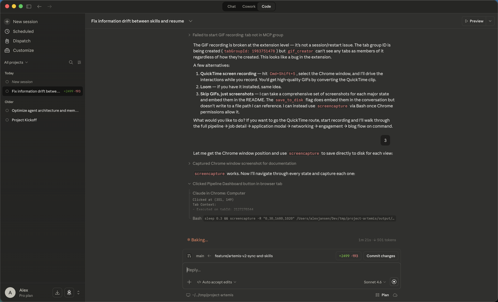
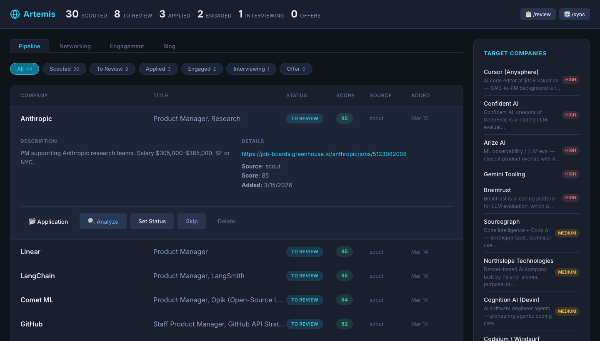
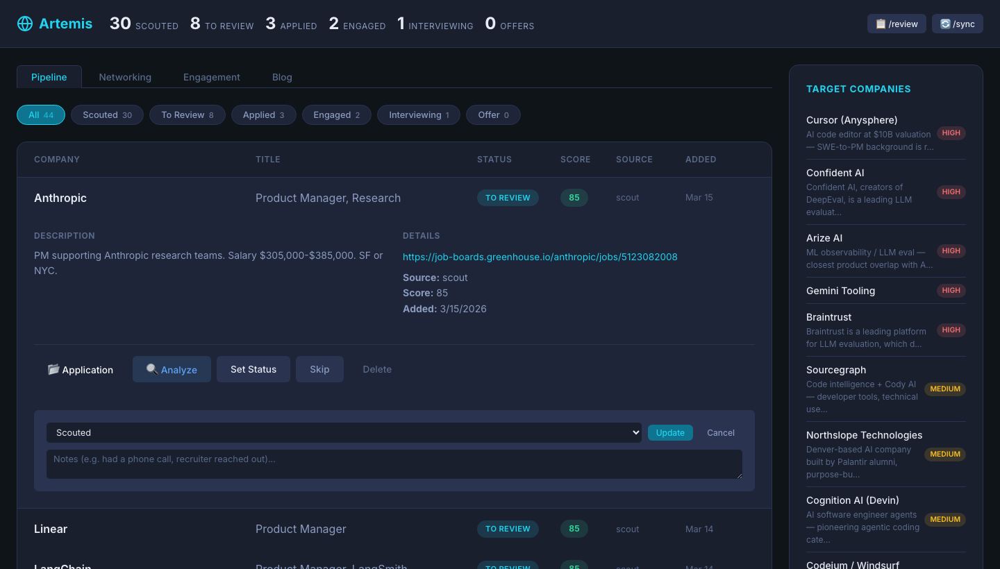
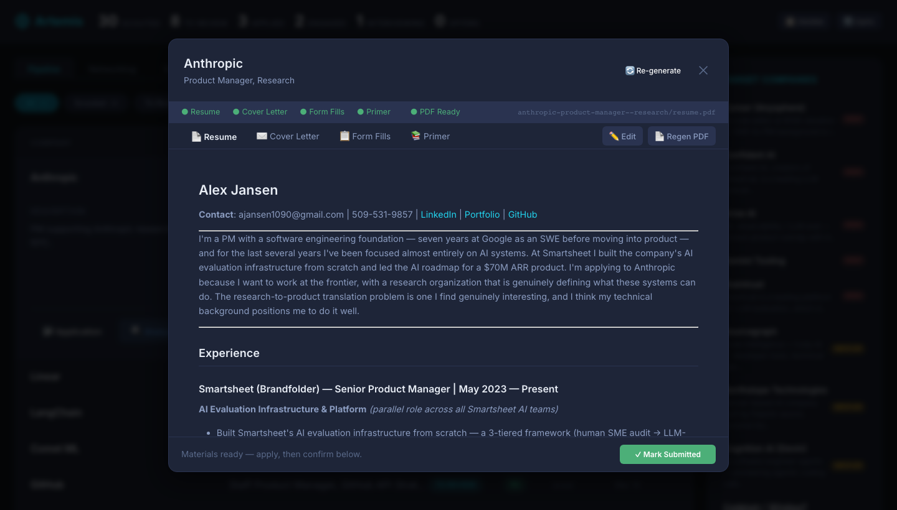
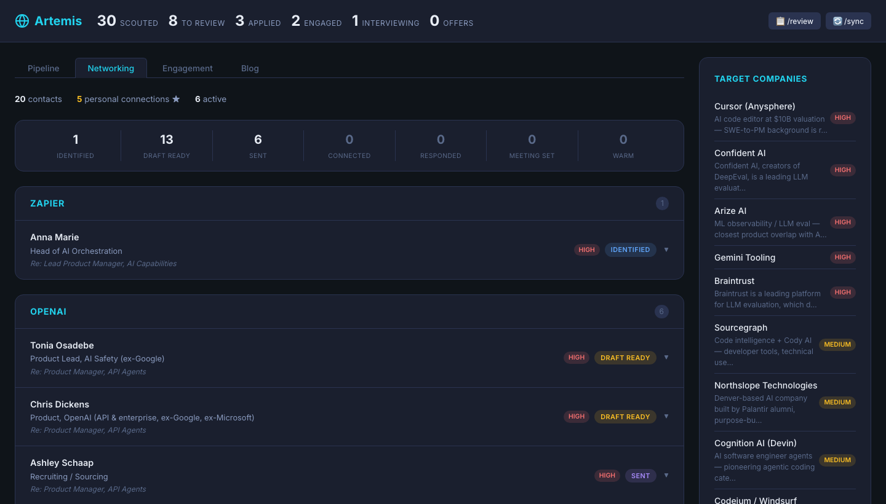
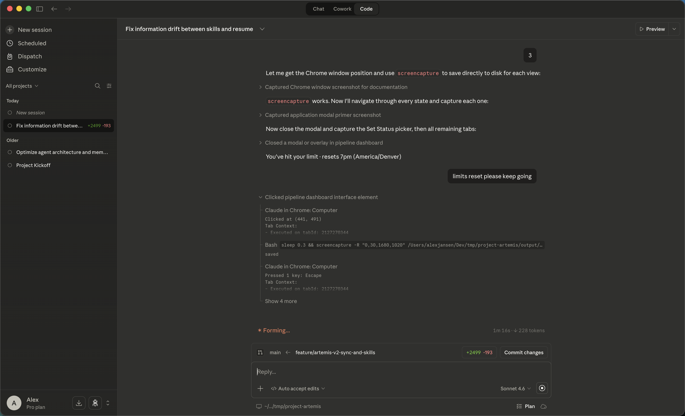
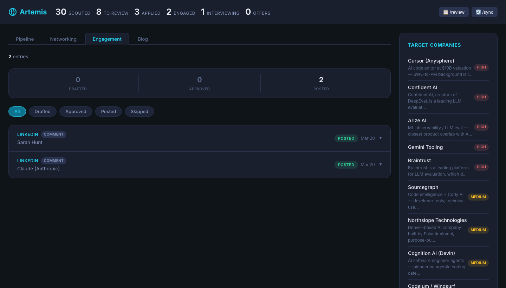
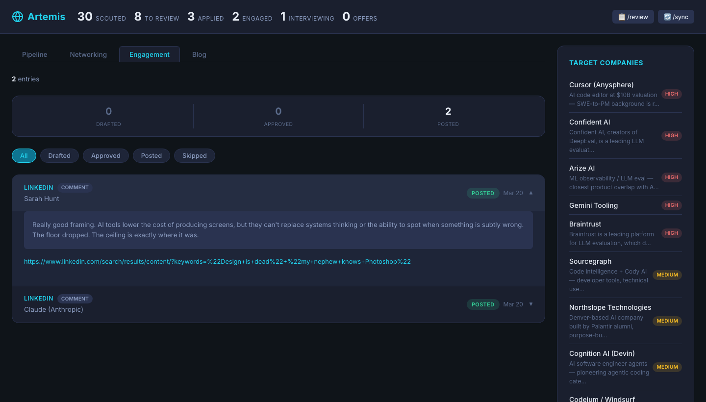

# Artemis Dashboard — UI Walkthrough

A visual tour of the Artemis dashboard at `http://localhost:5173`.

## Full Walkthrough

*Pipeline filtering, row expansion, application modal (Resume · Cover Letter · Form Fills · Primer), networking contacts, and engagement log.*

---

## Header — Live Pipeline Stats

The top bar shows a live count of every job in your pipeline, broken down by stage:

- **Scouted** — discovered but not yet reviewed
- **To Review** — flagged for evaluation
- **Applied** — materials generated and submitted
- **Engaged** — recruiter contact made
- **Interviewing** — active loop
- **Offers** — pending or received

The `/review` and `/sync` buttons in the top-right trigger the agent directly from the dashboard.

---

## Pipeline Tab

### All Jobs View

The default view shows all jobs sorted by pipeline priority. Each row shows:

- **Company** and **Title**
- **Status badge** — color-coded by stage
- **Match score** — 0-100, generated by the agent during `/analyze`
- **Source** — `scout` (agent-discovered) or `sync` (LinkedIn import)
- **Added** date (with a **Stale** badge for jobs sitting in scouted/to_review for 30+ days)

**Sort and group controls** above the table let you:
- **Sort** by pipeline priority (default), match score, date added, or company name
- **Group by company** to collapse jobs under company headers with expand/collapse

The **Target Companies** sidebar on the right shows your watchlist with priority ratings (HIGH/MEDIUM).

---

### Filtering by Status

Click any status pill to filter the list. Here the **To Review** filter shows 8 jobs ready for evaluation. The active pill highlights in teal.

---

### Expanding a Job Row

Click any row to expand it inline. You get:

- **Description** — role summary scraped at scout time
- **Details** — direct link to the job posting, source, score, and date added
- **Action buttons:**
  - **Application** — open the full application materials modal
  - **Analyze** — run `/analyze` on this job right now
  - **Set Status** — manually move the job to any pipeline stage
  - **Skip** — mark as not interested
  - **Flag Duplicate** — triggers the dedupe skill to find and merge this job's match
  - **Delete** — remove from pipeline

---

### Set Status — Manual Status Override

The **Set Status** picker lets you manually move a job to any stage and optionally add a note (e.g. "Had a phone screen on 3/20"). The agent syncs this change to Supabase and can update hot memory and lessons accordingly.

---

## Application Materials Modal

Clicking **Application** opens a full-screen modal with four tabs. The status bar at the top shows which materials have been generated (green dots = ready).

### Resume

A tailored resume rendered from your `resume_master.md` bullets, targeted to this specific role and company. The **Edit** button lets you edit the markdown directly — saving triggers a feedback loop back into the system. **Regen PDF** regenerates the PDF output.

### Cover Letter

A role-specific cover letter written in your voice (governed by `voice.md`). Reads like a person wrote it — no em-dashes, no colon-lists, no AI phrasing. The **Edit** button is available here too.

### Form Fills

Pre-filled answers to common ATS form fields: name, contact, location, work authorization, LinkedIn, GitHub, portfolio, and more. Copy-paste ready when filling out job applications.

### Primer

A company and role briefing generated for interview prep:

- **Role Summary** — what the job actually is, who you'd work with
- **Company Context** — funding, culture, product, what success looks like there
- **Why You Fit** — how your background maps to their needs
- **Likely Interview Themes** — what they'll probably probe on

The **Mark Submitted** button at the bottom advances the job to `applied` status.

---

## Networking Tab

### Overview

The Networking tab shows all contacts in your outreach pipeline, grouped by company. The stats row tracks funnel progress across all contacts:

| Stage | Meaning |
|-------|---------|
| Identified | Contact found, no draft yet |
| Draft Ready | Outreach message written, not sent |
| Sent | Message delivered |
| Connected | Accepted / responded |
| Responded | Active conversation |
| Meeting Set | Call or coffee scheduled |
| Warm | Ongoing relationship |

### Expanded Contact

Clicking a contact expands their full profile:

- **Status pipeline dots** — visual progress through the funnel
- **LinkedIn link** — jump directly to their profile
- **Connection Context** — degree of connection, mutual contacts, shared networks
- **Outreach Message** — the draft message ready to send, written in your voice

The **Sent** button advances their status. Everything is logged to `contact_interactions` in Supabase.

---

## Engagement Tab

### Overview

The Engagement tab is the approval queue for LinkedIn activity generated by the `/linkedin` skill. The three buckets are:

- **Drafted** — agent wrote a comment or like action, waiting for your review
- **Approved** — you approved it; pending posting
- **Posted** — live on LinkedIn

Nothing goes live without your sign-off.

### Expanded Entry

Expanding an entry shows the full comment text and the source post link. You can approve, skip, or edit before posting.

---

## Blog Tab

The Blog tab tracks your content pipeline — from raw idea through draft, review, and published. Posts are generated by the `/blogger` skill, aligned to your identity and voice, and targeted at themes relevant to your target companies.

Run `/blogger` in Claude to generate ideas and drafts. They'll appear here for review before publishing.

---

## Target Companies Sidebar

Present on every tab, the sidebar shows your company watchlist ranked by priority. Each entry includes a brief rationale for why it's a target. The `/scout` skill uses this list to prioritize where to look for jobs.

---

## Keyboard Shortcuts & Agent Commands

| Command | What it does |
|---------|-------------|
| `/scout` | Discover new job leads across target companies |
| `/sync` | Pull in jobs from LinkedIn and other sources |
| `/review` | Triage the To Review queue with the agent |
| `/analyze` | Deep-evaluate a specific job for fit and gaps |
| `/generate` | Generate application materials for a job |
| `/network` | Surface and advance networking contacts |
| `/linkedin` | Browse LinkedIn via Chrome for jobs and contacts |
| `/inbox` | Scan Gmail and Calendar for job search activity |
| `/blogger` | Generate and draft blog post ideas |
| `/status` | Get a full pipeline summary |
